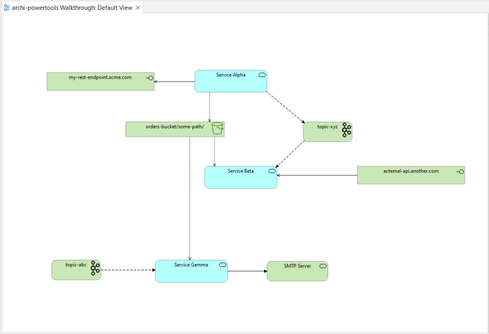
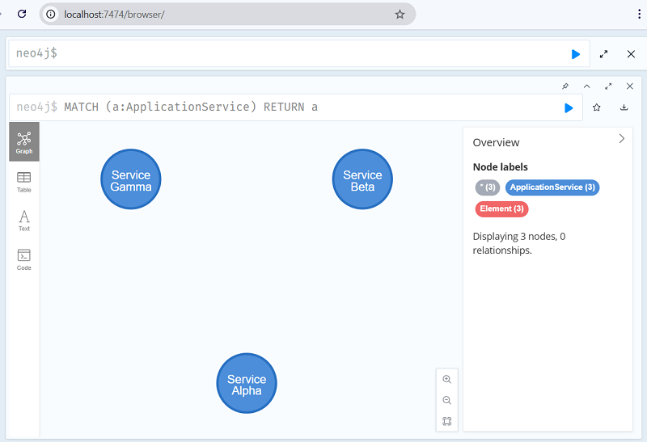

This a fully-functional implementation of chatbot
which can reason and answer question about
information in your ArchiMate® model.

# What's under the hood

- The chatbot reads enterprise/system architecture models in [the Archi® modelling toolkit](https://www.archimatetool.com/)'s format.
(You don't need to install the toolkit to use the chatbot.)

- The chatbot uses [archi-powertools-verifier](https://github.com/MaksimAniskov/archi-powertools-verifier)'s machinery
to read the model and import it a Neo4j graph database it runs in a container.

- The chatbot is configured to understand [archi-powertools-inspector](https://github.com/MaksimAniskov/archi-powertools-inspector)'s markup.
The markup enriches the model with information which describes the system's deployment configuration on "real" infrastructure.

- The chatbot uses [OpenAI API and AI models](https://platform.openai.com/).

For the demonstration, we are going to use the demo model file _archi-powertools-walkthrough.archimate_ which is in this repository.
This is a screenshot of what is in the model.



# Prerequisites
- Make sure you have installed [Docker Compose](https://docs.docker.com/compose/install/) or compatible container engine.
- Register on [OpenAI developer platform](https://platform.openai.com/).
Create your OpenAI API key.
Top up your credit balance.
$5 of credits will be more than enough for running the demonstration scenario.

# Setting it up

~~~sh
wget https://raw.githubusercontent.com/MaksimAniskov/archi-powertools-chatbot/refs/heads/1.x/archi-powertools-walkthrough.archimate
wget https://raw.githubusercontent.com/MaksimAniskov/archi-powertools-chatbot/refs/heads/1.x/compose.chatbot.yaml
wget https://raw.githubusercontent.com/MaksimAniskov/archi-powertools-verifier/refs/heads/1.x/compose.yaml
wget https://raw.githubusercontent.com/MaksimAniskov/archi-powertools-verifier/refs/heads/1.x/compose.ui.yaml
~~~

# Demonstration

Run the chatbot container and its dependencies.
~~~sh
OPENAI_API_KEY=... \
ARCHI_FOLDER=. \
ARCHI_FILE=archi-powertools-walkthrough.archimate \
docker compose -f compose.yaml -f compose.ui.yaml -f compose.chatbot.yaml run --rm chatbot
~~~

Expect to see docker containers building and starting up.
~~~text
[+] Building 5.9s (17/17) FINISHED
  ...
[+] Creating 3/3
 ✔ Volume "demo_intermediate_files"  Created
 ✔ Container archi-powertools-chatboot-archi2csv-1        Created
 ✔ Container archi-powertools-chatboot-neo4j-1            Created
[+] Running 2/2
 ✔ Container archi-powertools-chatboot-archi2csv-1  Exited
 ✔ Container archi-powertools-chatboot-neo4j-1      Started
[+] Building 2.4s (10/10) FINISHED
  ...
~~~

Then following prompt for choosing AI model appears.
~~~text
Choose model from the list.
[0] o1-preview
[1] o1-mini
[2] gpt-4o
~~~

For sake of following example conversation, I'm going to use _o1-preview_ model. So, I type in _0_ and press _Enter_. My output is like this.
~~~text
> 0
Using model o1-preview.
Ask your questions.
~~~

Here I begin my conversation with the AI. My question is about microservices it finds in the ArchiMate model.
~~~text
Your question > Show me all microservices

> Entering new GraphCypherQAChain chain...
Generated Cypher:
MATCH (a:ApplicationService) RETURN a
Full Context:
[{'a': {'archi_id': 'id-8e5aedd18d9a42749428a51b52cf8912', 'documentation': '', 'name': 'Service Alpha', 'specialization': ''}}, {'a': {'archi_id': 'id-6c4b1a8d76c54fc4882f8e0d7e8910f2', 'documentation': '', 'name': 'Service Beta', 'specialization': ''}}, {'a': {'archi_id': 'id-8992258f1f054aa7b91996376b69236b', 'documentation': '', 'name': 'Service Gamma', 'specialization': ''}}]

> Finished chain.
Intermediate steps: [{'query': 'MATCH (a:ApplicationService) RETURN a'}, {'context': [{'a': {'archi_id': 'id-8e5aedd18d9a42749428a51b52cf8912', 'documentation': '', 'name': 'Service Alpha', 'specialization': ''}}, {'a': {'archi_id': 'id-6c4b1a8d76c54fc4882f8e0d7e8910f2', 'documentation': '', 'name': 'Service Beta', 'specialization': ''}}, {'a': {'archi_id': 'id-8992258f1f054aa7b91996376b69236b', 'documentation': '', 'name': 'Service Gamma', 'specialization': ''}}]}]

Final answer: Service Alpha, Service Beta, Service Gamma are all microservices.
~~~

> **_NOTE:_** [_Neo4j Browser_ UI](https://neo4j.com/docs/browser-manual/current/about-browser/) is a part of this setup. It is available at http://localhost:7474/  
> Open the link in your browser, then you will be able to use it to run those queries the chatbot generates and check their correctness.  
> 

Let's continue.
~~~text
Your question > Describe Alpha

> Entering new GraphCypherQAChain chain...
Generated Cypher:
MATCH (n{name:'Alpha'})-[r]-(m)
RETURN n, r, m
Full Context:
[]

> Finished chain.
Intermediate steps: [{'query': "MATCH (n{name:'Alpha'})-[r]-(m)\nRETURN n, r, m"}, {'context': []}]
Final answer: I don't know the answer.
~~~

It could not find the element by exact match.
Let's try approximate search.
(From here on, I omit verbosity from the responses leaving only the Cypher queries and the AI's final answer.)
~~~text
Your question > Describe Alpha. Use approximate search.

Generated Cypher:
MATCH (e) WHERE apoc.text.levenshteinSimilarity(e.name, 'Alpha') > 0.3
OPTIONAL MATCH (e)-[r]-()
RETURN e, r

Final answer: Service Alpha is a service that involves Access, Flow, and Serving relationships, and is presented in Archi_PresentedIn.
~~~

~~~text
Your question > Show all Kafka producers

Generated Cypher:
MATCH (e)-[:Flow]->(t{specialization:'Kafka topic'})
RETURN DISTINCT e.name

Final answer: Service Alpha is a Kafka producer.
~~~

~~~text
Your question > Show all Kafka consumers

Generated Cypher:
MATCH (app:ApplicationService)<-[:Flow]-({specialization:'Kafka topic'})
RETURN DISTINCT app.name

Final answer: Service Beta, Service Gamma are the Kafka consumers.
~~~

~~~text
Your question > Which Kafka topic Service Alpha does produce to?

Generated Cypher:
MATCH (e{name:'Service Alpha'})-[:Flow]->(topic{specialization:'Kafka topic'})
RETURN DISTINCT topic.name

Final answer: topic-xyz is the Kafka topic Service Alpha produces to.
~~~

~~~text
Your question > Which services do produce to topic topic-xyz?

Generated Cypher:
MATCH (e)-[:Flow]->({name:'topic-xyz', specialization:'Kafka topic'})
RETURN DISTINCT e.name

Final answer: Service Alpha produces to topic topic-xyz.
~~~

~~~text
Your question > Which services do write to or read from AWS S3?

Generated Cypher:
MATCH (s:ApplicationService)-[:Flow]-({specialization:'AWS S3 object'})
RETURN DISTINCT s.name
Full Context:
[]

> Finished chain.
Intermediate steps: [{'query': "MATCH (s:ApplicationService)-[:Flow]-({specialization:'AWS S3 object'})\nRETURN DISTINCT s.name"}, {'context': []}]
Final answer: I don't know the answer.
~~~

~~~text
Your question > Which services do write to or read from AWS S3? Relationship type is Access.

Generated Cypher:
MATCH (s:ApplicationService)-[:Access]->(e{specialization:'AWS S3 object'})
RETURN DISTINCT s.name

Final answer: Service Gamma, Service Beta, Service Alpha write to or read from AWS S3.
~~~

~~~text
Your question > Which external APIs are in use?

Generated Cypher:
MATCH (app:ApplicationService)-[:Flow]->(api{specialization:'HTTP REST'})
RETURN DISTINCT api.name

Final answer: I don't know which external APIs are in use.
~~~

~~~text
Your question > Which external APIs are in use? Look for relations in all directions.

Generated Cypher:
MATCH (api {specialization: 'HTTP REST'})--()
RETURN DISTINCT api.name

Final answer: my-rest-endpoint.acme.com, external-api.another.com are external APIs in use.
~~~

The ArchiMate model I use for this demonstration has
[archi-powertools-inspector](https://github.com/MaksimAniskov/archi-powertools-inspector)'s
markup on some of the relationships.

In a nutshell, [archi-powertools-inspector](https://github.com/MaksimAniskov/archi-powertools-inspector)
is a tool that understands properties one provides for the model's relationships or elements.
The properties are supposed to build links between the model and "real" infrastructure or source code.
For example, property with name ```pwrt:inspector:value-ref``` is a pointer which can be a href to a specific line
of source code on a git repository,
or a pointer to a Kubernetes resource's configuration value,
or to an AWS resource.
The tool automates keeping those links current and _inspected_ for correctness.
Hence, "inspector".

Let's make the AI use knowledge it can derive from those pointers.

~~~text
Your question > Show how Service Alpha gets its configuration

Generated Cypher:
MATCH ({name:'Service Alpha'})-[r]-()
WHERE r.`pwrt:inspector:value-ref` IS NOT NULL
RETURN r.`pwrt:inspector:value-ref`

Final answer: Service Alpha gets its configuration from:
- AWS SSM Parameter Store at the path `/alpha/Prod/config/S3bucket` (Parameters/Value)
- The configuration file located at `gitlab.acme.com/systemA/alpha/-/blob/main/src/config.txt` on line 27
- Kubernetes Ingress resource in the `alpha` namespace at `https://kubernetes.acme.com`, combining host and HTTP paths from `spec.rules[0]`
~~~

To stop the conversation, type _quit_.
~~~text
Your question > quit
~~~
